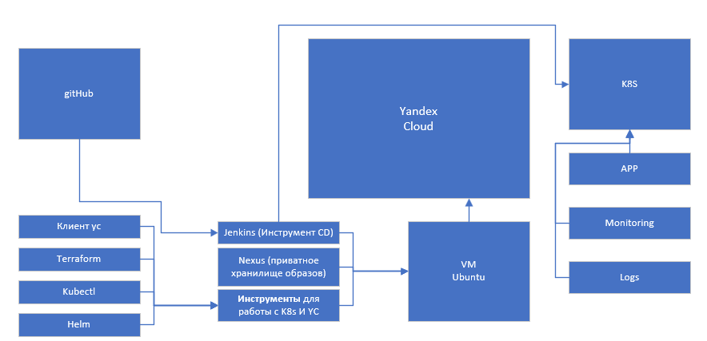
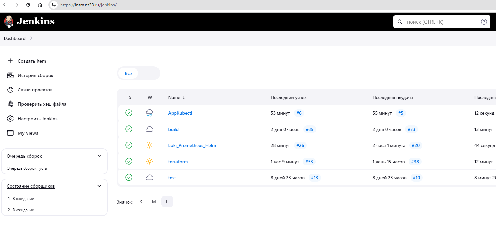
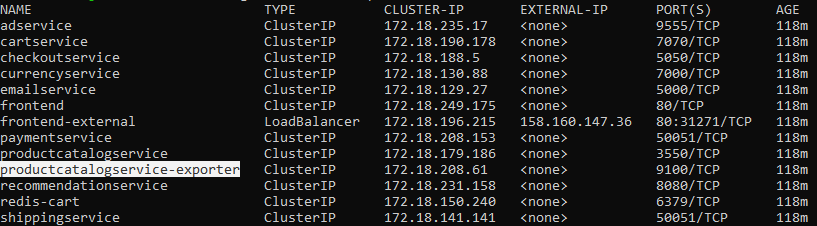
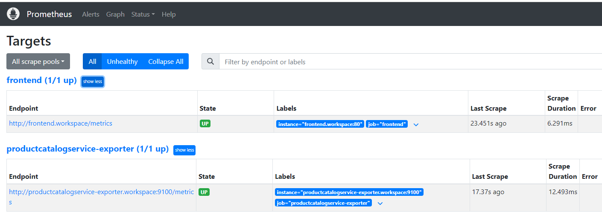
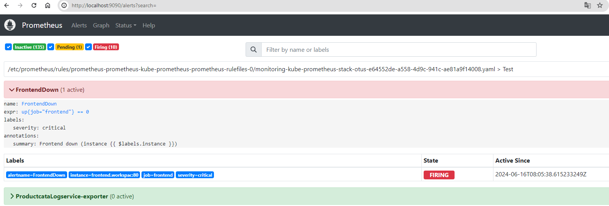
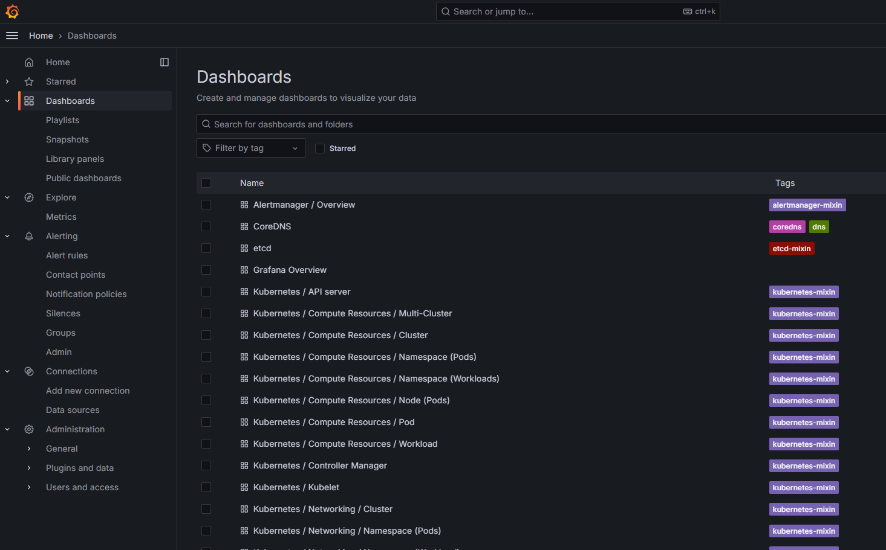
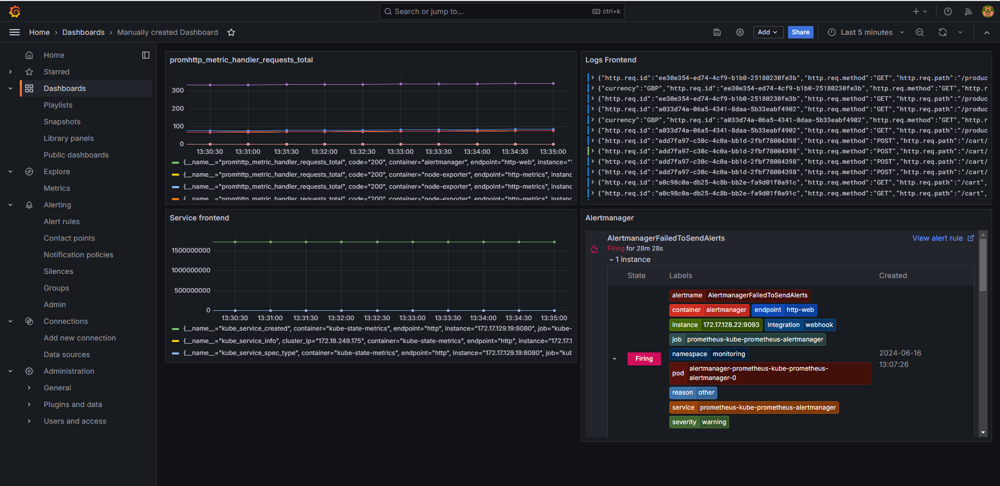

# k8s-otus-2024
## Цели проекта:
* Подтвердить знания, полученные при прохождении курса.
* Научиться использовать инструменты: Helm, kubectl, Yandex.Cloud CLI.
* Освоить применение платформы Kubernetes в микросервисной архитектуре.
* Научиться выстраивать процесс сборки микросервисов.
* Разработать процессы мониторинга и логирования микросервисов и самого кластера.

## Описание технологий
Проект Online Boutique by Google был взят за основу. Для его реализации используются следующие решения и технологии:
* Кластер развернут в Yandex Cloud для обеспечения надежности и масштабируемости.
* Хранение кода осуществляется на платформе GitHub для эффективного управления версиями и совместной разработки.
* Непрерывная поставка осуществляется с использованием Jenkins (доступ по ссылке: https://intra.nt33.ru/jenkins) для автоматизации процесса сборки и развертывания кода.
* Артефакты сборок (images) сохраняются в Nexus (доступ по ссылке: https://intra.nt33.ru/nexus, docker.nt33.ru) для удобного управления и хранения загруженных образов Docker.
* Для создания кластера используется Terraform для автоматизации процесса развертывания и настройки инфраструктуры.
* Для мониторинга и логирования используются Prometheus и Loki, установленные с помощью Helm, что обеспечивает прозрачное отслеживание и анализ работы приложения.
* Для управления приложениями в кластере используется утилита kubectl, обеспечивающая удобное управление контейнеризированными приложениями в Kubernetes.
* Для исправления и упрощения ведения документации используется Chad AI

## CI/CD
Код размещен на GitHub. (Для переиспользования требуется огромная переработка, дабы костыли, которые в нем присутствуют стали архитектурным решением!!!)

Пайплайны сборки и деплоя настроены в Jenkins. [Основной код пайплайнов](cicd/jenkins)

Основные задачи, выполняемые в пайплайнах:
* Build: для сборки образов и их размещения в Nexus
* Terraform: для создания и удаления кластера Kubernetes в Yandex.Cloud
* Loki_Prometheus_Helm: для установки/обновления/удаления Prometheus и Loki
* AppKubectl: для установки и удаления приложения

## MS
* Все сервисы были пересобраны и размещены в приватном репозитории (docker.nt33.ru).
* В сервисе frontend был подключен модуль Prometheus для сбора метрик ([Метрики](http://otus.nt33.ru/metrics)). Кроме того, в деплой модуля был добавлен дополнительный объект ServiceMonitor. [Код](project/microservices/src/frontend).
* При сборке сервиса productcatalogservice в Dockerfile была добавлена операция по добавлению prometheus-exporter. [Код](project/microservices/src/productcatalogservice).

## Prometheus (Мониторинг и оповещение)
* Установка выполняется с использованием helm chart от prometheus-community/kube-prometheus-stack, а также конфигурационного файла [prometheus-values.yaml](configs\prometheus-values.yaml).
* Добавлены две дополнительные точки для сбора метрик (описанных в MS) - frontend, productcatalogservice-exporter.
* Созданы два дополнительных правила для отправки уведомлений в AlertManager - FrontendDown, Productcatalogservice-exporter.
* Настроен виртуальный канал для отправки сообщений в Telegram.

## Loki (централизованое хранилище)
В связи с жесткой нехваткой времени пришлось переиспользовать код ДЗ с использованием S3 хранилища от YC

## Grafana (Отображение метрик и логов)
* Установка происходила совместно с prometheus
* Переиспользованы стандартные Dashbord из helmchart prometheus-community/kube-prometheus-stack

* Создан руками (процесс не автоматизирован) примитивные метрики с frontend и productcatalogservicezaz

## Установка и развёртывание приложения
* Было принято решение использовать инструмент kubectl с целью получения начального опыта работы с этой утилитой.
* В процессе настройки сценария развёртывания были внесены изменения для интеграции с Prometheus и настройки системы алертинга.
* Веб-страница http://otus.nt33.ru

## Дополнительно
* Было развернут VM в yc для автоматизации процесса сборки и развертывания
* Сконфигурировано окружение для работы с yc (terraform, yc cli, helm, kubectl, jenkins, nexus)
* Изучено взаимодействие K8S c приватными репозиториями
* Написаны пайплайны для автоматизации процеса сборки, разворачивания и деплоя
* Очень много пришлось использовать отладку с использованием параметров logs и describe
* Научился дополнительно читать и конфигурировать чужие helmchart

## Не успел
* Документация по проекту
* Ведение Changelog
* Отчетливые коммиты, все коммиты отладки обьеденены и "заforceл"
* Внедрить более детальное логирование и трассировку
* Оттестировать все дополнительные сценарии
* Встроить в процесс сборки инструменты проверки кода и image (только заглушки, только хардкор)
* Автоматическое создание custom dashboard в Grafana
